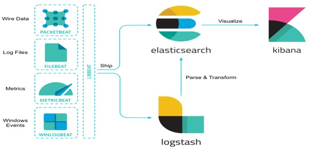
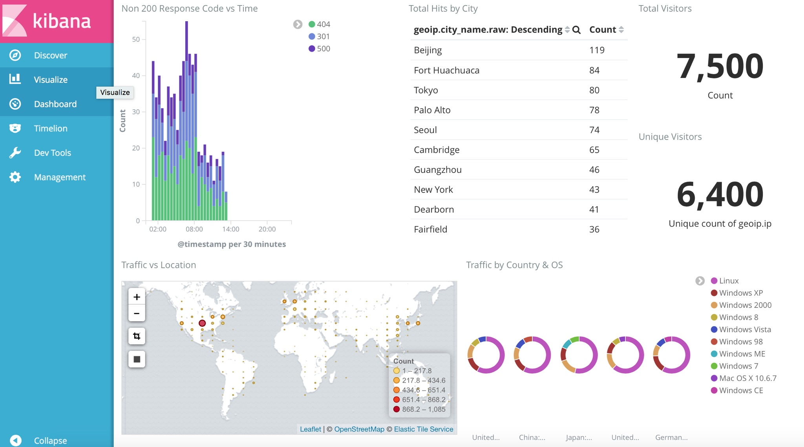

# ELK Stack - Tech Talk

### Team: Pranav Kulkarni (pkulkar5), Vivekanand Ramakrishnan (vramakr2)

### Introduction
**What is ELK Stack?**

The ELK Stack is a collection of three open-source products — Elasticsearch, Logstash, and Kibana — from Elastic.

**E**lasticSearch - It is a distributed, RESTful search and analytics engine.

**L**ogStash - It is a server-side data processing pipeline that centralizes, transforms and stashes data.

**K**ibana - It is a window into the Elastic Stack, enables visual exploration and real-time analysis of data in Elasticsearch

Beats - It is the platform for single-purpose data shippers. They install as lightweight agents and send data from hundreds or thousands of machines to Logstash or Elasticsearch.

### Purpose
**Why use ELK Stack?**

As more and more IT infrastructures move to public clouds, log analytics platforms are becoming more and more critical. In cloud-based infrastructures, performance isolation is extremely difficult. Different applications feed into each other. Debugging an issue requires logging into each individual box to look at the logs. With small number of apps/boxes it's not an issue, but it quickly becomes tedious as the number of apps/boxes increase. The performance of virtual machines in the cloud can greatly fluctuate based on the specific loads, infrastructure servers, environments, and number of active users. Log management platform can monitor all of these infrastructure issues. It enables centralized logging which helps in identifying problems with your servers or applications, allowing you to search through and analyze all of your logs in a single place. In all of these contexts, DevOps engineers, system administrators, site reliability engineers, and developers can all use logs to make better decisions that are data-informed.

ELK is most commonly used in log analysis in IT environments (though there are many more use cases for the ELK Stack starting including business intelligence, security and compliance, and web analytics).

The ELK Stack is downloaded 500,000 times every month, making it the world’s most popular log management platform. Companies like Netflix, Facebook, Microsoft, LinkedIn, and Cisco monitor their logs using ELK.

### Setup

#### ELK Server

*Prerequisites*

* OS: Ubuntu 16.04
* RAM: 4GB
* CPU: 2

*Install Java 8*

	sudo add-apt-repository -y ppa:webupd8team/java
	sudo apt-get update
	sudo apt-get -y install oracle-java8-installer

*Install Elasticsearch*

	wget https://artifacts.elastic.co/downloads/elasticsearch/elasticsearch-5.2.2.tar.gz
	sha1sum elasticsearch-5.2.2.tar.gz 
	tar -xzf elasticsearch-5.2.2.tar.gz

*Install Logstash*

	wget https://artifacts.elastic.co/downloads/logstash/logstash-5.2.2.tar.gz
	sha1sum logstash-5.2.2.tar.gz
	tar -zxf logstash-5.2.2.tar.gz

*Install Kibana*

	wget https://artifacts.elastic.co/downloads/kibana/kibana-5.2.2-linux-x86_64.tar.gz
	sha1sum kibana-5.2.2-linux-x86_64.tar.gz 
	tar -xzf kibana-5.2.2-linux-x86_64.tar.gz
	rm -rf *.gz

*Configure & Start Elasticsearch*

	cd elasticsearch-5.2.2/
	bin/elasticsearch

*Configure & Start Logstash*

	cd logstash-5.2.2/
	vi logstash.conf (copy file from this repo)
	vi apache_template.json (copy file from this repo)
	bin/logstash -f logstash.conf

*Configure & Start Kibana*

	cd kibana-5.2.2-linux-x86_64/
	vi config/kibana.yml (copy file from this repo)
	bin/kibana

#### App Server

*Install FileBeat*

	wget https://artifacts.elastic.co/downloads/beats/filebeat/filebeat-5.2.2-linux-x86_64.tar.gz
	sha1sum filebeat-5.2.2-linux-x86_64.tar.gz
	tar -xzf filebeat-5.2.2-linux-x86_64.tar.gz
	rm -rf *.gz

*Install Fake Log Generator*

	sudo apt-get update
	sudo apt-get install git
	sudo apt-get install python-pip python-dev
	git clone https://github.com/pranavkulkarni/Fake-Apache-Log-Generator.git
	cd Fake-Apache-Log-Generator
	sudo pip install -r requirements.txt

*Configure & Start FileBeat*

	cd filebeat-5.2.2-linux-x86_64
	vi filebeat.yml (copy file from this repo)
	./filebeat

*Configure & Start Fake Log Generator*
	
	(On app server 1)
	python apache-fake-log-gen.py --num 2500 -o LOG -p apache -lst 01:00:00
	python apache-fake-log-gen.py --num 2500 -o LOG -p apache -lst 01:00:00
	
	(On app server 2)	
	python apache-fake-log-gen.py --num 2500 -o LOG -p apache -lst 06:00:00
	python apache-fake-log-gen.py --num 2500 -o LOG -p apache -lst 06:00:00

### Demonstration

[Screencast link for ELK stack demo](https://www.youtube.com/watch?v=_Tbmm9-YGfI)

### Our Views

**Benefits**

* Open source and free - It provides almost similar functionality compared to proprietary log management platforms like Splunk at no cost.
* Real-time data and real-time analytics - It provides the ability to perform fast data extractions from virtually all structured or unstructured data sources.
* Scalable, high-availability - It allows you to scale horizontally by simply adding another node and letting the cluster reorganize itself to accommodate and exploit the extra hardware. Elasticsearch clusters are resilient, since they automatically detect and remove node failures.
* Full text search - Elasticsearch uses Lucene to provide full-text search capabilities. The search features come with multi-language support, an extensive query language, geolocation support, and context-sensitive suggestions, and autocompletion.

**Challenges**

*  Logs typically dont have the required contextual informaton to make decisions, hence you always need to supplement log analytics with APM tools like New Relic.
*  The other big challenge is knowing the right searches/queries to run. Knowing which queries/searches to run already presumes you know the problem or something about the problem.
*  It is not trivial to scale and manage Elasticsearch clusters.

### Resources

[Slides for ELK stack](ELK-TechTalk.pptx)

References-

[https://www.elastic.co/](https://www.elastic.co/)

[https://www.digitalocean.com/community/tutorials/how-to-install-elasticsearch-logstash-and-kibana-elk-stack-on-ubuntu-14-04
](https://www.digitalocean.com/community/tutorials/how-to-install-elasticsearch-logstash-and-kibana-elk-stack-on-ubuntu-14-04)

[http://logz.io/learn/complete-guide-elk-stack/](http://logz.io/learn/complete-guide-elk-stack/)

[https://www.devopslibrary.com/lessons/elk-stack-for-logging-tutorial](https://www.devopslibrary.com/lessons/elk-stack-for-logging-tutorial)

[https://oliverveits.wordpress.com/2016/11/17/logstash-hello-world/](https://oliverveits.wordpress.com/2016/11/17/logstash-hello-world/ )

[https://github.com/elastic/examples/tree/master/ElasticStack_apache](https://github.com/elastic/examples/tree/master/ElasticStack_apache)

